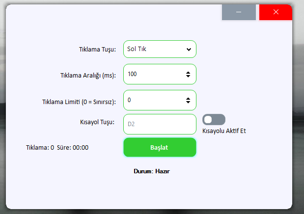

# 🖱️ Auto Clicker (C# - Guna UI2)

---

## 🇺🇸 English

A modern auto clicker built with **C# WinForms** and **Guna.UI2.WinForms**, featuring hotkey support, tray integration, click statistics, and a beautiful UI.

### ✅ Features
- Global hotkey activation (customizable)
- Right click / Left click selection
- Custom click interval and limit
- Tray icon with context menu (Show, Start/Stop, Exit)
- Save and load user settings
- Guna2 UI components (rounded corners, hover effects, shadow)
- Real-time click count and elapsed time
- Borderless draggable window
- Minimize to system tray
- Stylish start/stop button animations

### 🖼️ Screenshot

### 🛠️ How to Build
1. Clone the repository
2. Open in Visual Studio
3. Restore NuGet packages (Guna.UI2.WinForms)
4. Build and run

### 🔽 Download
Visit the [Releases](https://github.com/muhammednamli/AutoClicker-CSharp/relases) tab for the latest `.exe` version.

---

## 🇹🇷 Türkçe

**C# WinForms** ve **Guna.UI2.WinForms** kullanılarak geliştirilen modern bir otomatik tıklayıcı. Kısayol tuşu, tepsi simgesi, tıklama istatistikleri ve şık kullanıcı arayüzü içerir.

### ✅ Özellikler
- Global (kullanıcı tanımlı) kısayol tuşu desteği
- Sağ/Sol tık seçimi
- Özel tıklama aralığı ve tıklama limiti belirleme
- Sistem tepsisine küçülme ve sağ tık menüsü (Göster / Başlat-Durdur / Çıkış)
- Kullanıcı ayarlarını kaydetme ve yükleme
- Guna2 UI tasarımı (yuvarlak köşeler, hover efekti, gölgeler)
- Gerçek zamanlı tıklama sayısı ve geçen süre
- Sürüklenebilir kenarsız pencere
- Şık Başlat/Durdur butonu animasyonu

### 🖼️ Ekran Görüntüsü

### 🛠️ Nasıl Derlenir?
1. Repoyu klonla  
2. Visual Studio ile aç  
3. Gerekli NuGet paketlerini yükle (`Guna.UI2.WinForms`)  
4. Build et ve çalıştır

### 🔽 İndir
Son çıkan `.exe` sürümü için [Releases](https://github.com/muhammednamli/AutoClicker-CSharp/relases) sekmesini ziyaret et.

---

**💡 Açık kaynak katkılara açıktır.**  
Forklayabilir, geliştirebilir ve yıldızlayabilirsin ⭐

